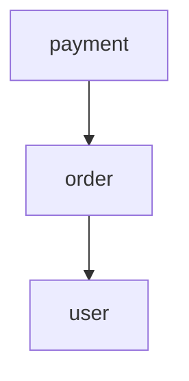

# gomodulith

**Architecture verification and modular monolith toolkit for Go.**

`gomodulith` aims to make modular monolith architecture explicit, testable, documentable, and friendly to both humans and AI coding agents.

It is inspired by the ideas behind Spring Modulith and architecture-testing tools, but is designed around Go's package model, `internal` visibility rules, `go/packages`, and idiomatic `go test` workflows.

> Status: early design / pre-alpha. The API examples below describe the intended developer experience and may change before the first release.

## Why

A Go monolith usually starts simple:

```text
internal/
├── user/
├── order/
├── payment/
└── notification/
```

As the codebase grows, module boundaries become conventions that live in people's heads:

- Which packages are public APIs of a module?
- Which modules may depend on each other?
- Is `order` allowed to import `user/internal`?
- Did a recent change introduce a dependency cycle?
- What is the actual module graph today?
- Can CI prevent architecture drift?
- Can an AI coding agent understand the same architectural constraints before editing code?

`gomodulith` is intended to turn those conventions into executable architecture.

## Goals

`gomodulith` is planned around six core capabilities:

1. **Module discovery** — derive application modules from a Go codebase.
2. **Boundary verification** — detect imports that violate module APIs.
3. **Dependency rules** — declare which modules may depend on which others.
4. **Cycle detection** — fail fast on cyclic module dependencies.
5. **Architecture documentation** — generate Mermaid / JSON representations of the real module graph.
6. **AI-readable architecture** — export machine-readable constraints that coding agents can consume before modifying a repository.

## Design principles

### Go-first

No annotations, decorators, runtime reflection framework, or Java-style container is required.

The design should work naturally with:

```text
go test ./...
go list
golang.org/x/tools/go/packages
internal packages
standard Go modules
```

### Architecture as code

Architecture rules should be executable in normal tests:

```go
func TestArchitecture(t *testing.T) {
    app := modulith.Scan(t, "./...")
    app.Verify()
}
```

A violation should look like a test failure, not a wiki page nobody remembers to update.

### Convention first, configuration when needed

A common module layout should work with little or no configuration:

```text
internal/
├── user/
│   ├── api/
│   ├── domain/
│   └── internal/
├── order/
│   ├── api/
│   ├── domain/
│   └── internal/
└── payment/
    ├── api/
    └── internal/
```

Cross-module imports may use a module's exported API:

```go
import "example.com/app/internal/user/api"
```

but should not reach into implementation details:

```go
import "example.com/app/internal/user/domain" // architecture violation
```

The exact conventions are still being designed and will be configurable where Go project layouts differ.

## Intended API

### Verify architecture

```go
func TestArchitecture(t *testing.T) {
    app := modulith.Scan(t, "./...")

    app.Verify()
}
```

Example output:

```text
✓ user
✓ order
✓ payment

order -> user/api         OK
payment -> order/api      OK
order -> user/internal    VIOLATION

cycle detected:
user -> order -> payment -> user
```

### Explicit module rules

For projects that do not follow the default conventions:

```go
func TestArchitecture(t *testing.T) {
    app := modulith.New(t).
        Module("user", "./internal/user/...").
        Module("order", "./internal/order/...").
        Module("payment", "./internal/payment/...")

    app.Module("order").
        AllowDependencies("user", "payment")

    app.Module("payment").
        AllowDependencies("user")

    app.Verify()
}
```

The fluent API above is illustrative; the final public API will be stabilized before v1.

## Module graph

A CLI is planned for inspecting the actual architecture:

```bash
gomodulith graph
```

Example:

```text
              ┌─────────┐
              │  user   │
              └────▲────┘
                   │
              ┌────┴────┐
              │  order  │
              └────▲────┘
                   │
              ┌────┴────┐
              │ payment │
              └─────────┘
```

Planned output formats:

```bash
gomodulith graph --format mermaid
gomodulith graph --format json
gomodulith graph --format d2
```

Possible Mermaid output:



## AI-readable architecture

One goal of `gomodulith` is to make architecture constraints consumable by coding agents.

```bash
gomodulith export --format json > .gomodulith/architecture.json
```

Example shape:

```json
{
  "modules": [
    {
      "name": "order",
      "public_packages": ["internal/order/api"],
      "allowed_dependencies": ["user", "payment"]
    }
  ],
  "rules": {
    "cycles": "forbidden",
    "internal_cross_module_imports": "forbidden"
  }
}
```

This can be used by CI, code-review automation, IDE integrations, and AI coding agents as a stable architecture contract.

## Planned checks

The first versions will focus on checks that can be derived reliably from Go's import graph:

- cross-module private package access;
- undeclared module dependencies;
- cyclic module dependencies;
- orphan / unclassified packages;
- forbidden package imports;
- public API package validation;
- module dependency graph changes.

Later versions may explore higher-level rules such as:

- event-based module interaction;
- module integration tests;
- architecture diffing between Git refs;
- runtime module observability;
- SARIF output for GitHub code scanning;
- editor / language-server integrations.

## CLI vision

```text
gomodulith verify
    Verify module boundaries and dependency rules.

gomodulith graph
    Render the discovered module graph.

gomodulith explain order
    Explain a module's public API, dependencies and dependents.

gomodulith export
    Export an AI/CI-readable architecture model.

gomodulith diff <base> <head>
    Show architecture changes between two revisions.
```

## Example CI workflow

Eventually, CI should be as simple as:

```yaml
- name: Verify architecture
  run: gomodulith verify ./...
```

and architecture tests should also remain runnable through standard Go tooling:

```bash
go test ./...
```

## Non-goals

`gomodulith` is **not** intended to become:

- a dependency injection container;
- a web framework;
- a service mesh;
- a microservice framework;
- a replacement for the Go compiler's `internal` rules;
- a general-purpose linter replacement;
- a runtime module system.

The focus is narrow: **make modular Go architecture explicit and enforceable.**

## Roadmap

### v0.1 — Architecture model

- [ ] load packages with `go/packages`;
- [ ] discover modules from conventions;
- [ ] build module dependency graph;
- [ ] detect cycles;
- [ ] report cross-module boundary violations;
- [ ] `gomodulith verify`;
- [ ] architecture tests through `go test`.

### v0.2 — Rules and configuration

- [ ] explicit module definitions;
- [ ] allowed / forbidden dependencies;
- [ ] public API package declarations;
- [ ] useful diagnostics with import paths and source positions;
- [ ] YAML or TOML project configuration if configuration proves necessary.

### v0.3 — Documentation

- [ ] Mermaid graph output;
- [ ] JSON architecture export;
- [ ] module dependency reports;
- [ ] `gomodulith explain`.

### v0.4 — CI and architecture evolution

- [ ] architecture diff between Git revisions;
- [ ] SARIF output;
- [ ] GitHub Actions examples;
- [ ] machine-readable architecture contracts for AI coding agents.

## Project philosophy

A modular monolith should not depend on developers remembering a diagram from six months ago.

The source code already contains the real dependency graph. `gomodulith` should read that graph, compare it with the intended architecture, and make divergence impossible to ignore.

```text
architecture convention
        ↓
architecture model
        ↓
verification
        ↓
CI
        ↓
documentation + AI context
```

If the architecture changes, the contract changes with it — deliberately and visibly.

## Contributing

The project is currently in the design stage. Issues discussing module discovery rules, package conventions, diagnostics, and public API design are especially welcome.

## License

A license will be added before the first release.
